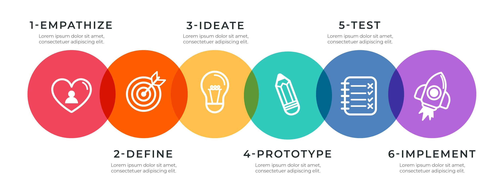
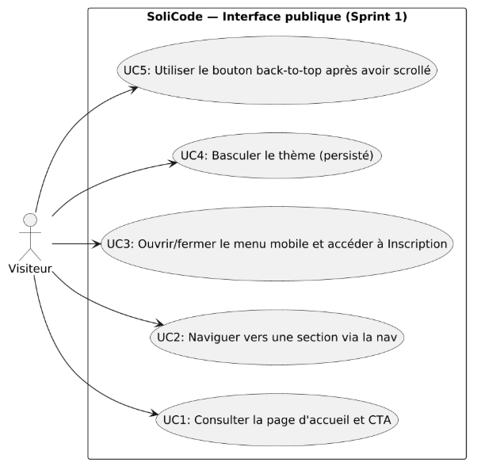
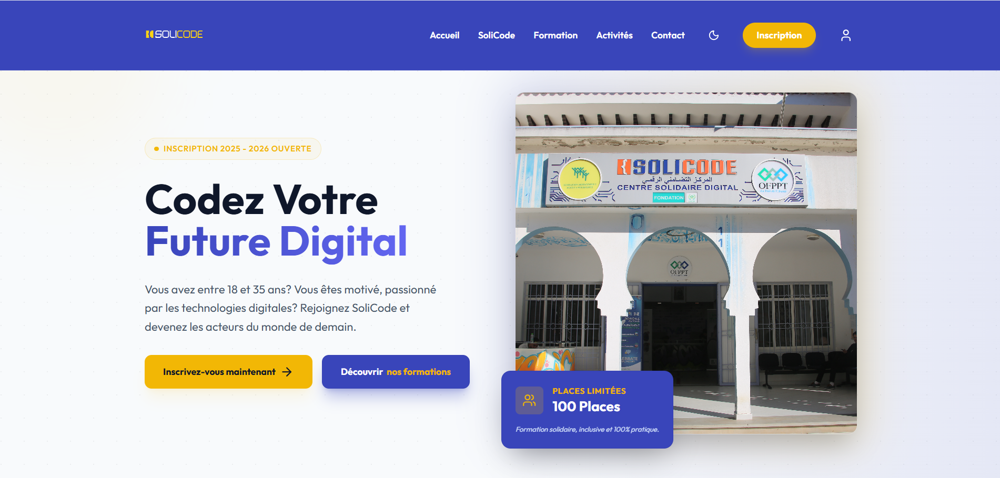

# Refonte Inscription SoliCode
### Sprint 1 — Interface publique

**Réalisé par :**   EL ACHIRI MOHAMED AYMANE 
**Encadré par :** M. ESSARRAJ Fouad

---

# Contexte & objectif Sprint 1

Livrer une interface publique statique et responsive qui reflète la maquette :
- Présentation du centre (hero, valeurs)
- Catalogue des formations (Web & Mobile)
- Navigation responsive (menu mobile)
- Contact & carte intégrée
- UX accessible et animations légères

---
# Méthodologies
 Méthodologie ( SCRUM )

---

# Méthodologies

 Méthodologie ( design Thinking )

---
# Fonctionnalités
- Navigation responsive (desktop + mobile)
- Hero avec CTA d'inscription
- Section statistiques (KPI)
- Fiches formations (liste / détail)
- Formulaire contact simple
- Menu mobile avec icône utilisateur
- Thème clair/sombre persistant
- Smooth scroll + back-to-top
- Icônes Lucide + animations Motion One

---
<!-- # use case  -->
## use case

---

# Lab
-LENIS

---

# maquette 

    

---

# Scripts & Interactions techniques

Implémenté dans index.html :
- Tailwind config (couleurs soliBlue / soliYellow, fonts)
- Lucide.createIcons()
- Lenis smooth scroll (global, scroll-to anchors)
- Motion One (inView animations, hero load, scroll progress)
- Theme toggle (localStorage)
- Mobile menu open/close logic
- Back-to-top integrated with Lenis

---

# Des retours ?

